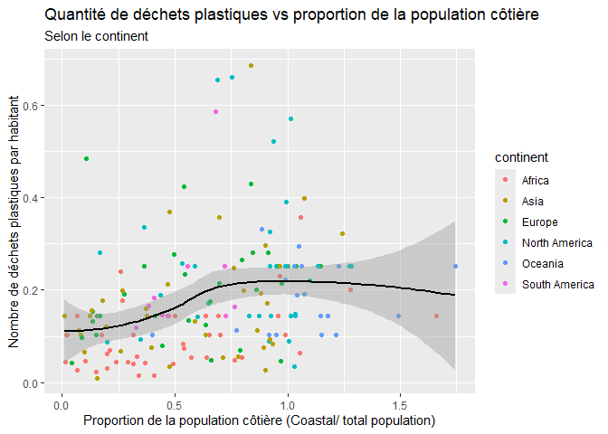

Lab 02 - Plastic waste
================
Coralie Morin
15 septembre 2025

## Chargement des packages et des données

``` r
library(tidyverse)
```

``` r
plastic_waste <- read_csv("data/plastic-waste.csv")
```

Commençons par filtrer les données pour retirer le point représenté par
Trinité et Tobago (TTO) qui est un outlier.

``` r
plastic_waste <- plastic_waste %>%
  filter(plastic_waste_per_cap < 3.5)
```

## Exercices

### Exercise 1

``` r
ggplot(plastic_waste,aes(x = plastic_waste_per_cap)) + geom_histogram(binwidth = 0.2) + facet_wrap( ~ continent )
```

<!-- --> En
comparant les continents selon leur quantité déchets plastiques, il est
possible de constater que l’Amérique du Sud et l’Océanie sont les
continents qui en possèdent le moins.

### Exercise 2

``` r
 ggplot(plastic_waste,aes(x = plastic_waste_per_cap, colour=continent, fill=continent))+ geom_density (alpha=0.4)
```

<!-- -->

Le réglage de la couleur (color et fill) se retrouve dans aes\_
puisqu’il est relié avec une variable qui est dans ce cas, les
continents. Cependant, la transparence (alpha) est dans geom_density,
puisqu’elle n’est pas reliée aux variables et s’applique pour toute le
graphique.

### Exercise 3

Boxplot:

``` r
ggplot(plastic_waste, aes(x = continent, y=plastic_waste_per_cap)) +
  geom_boxplot()
```

<!-- -->

Violin plot:

``` r
ggplot(plastic_waste, aes(x = continent, y=plastic_waste_per_cap)) +
  geom_violin()
```

<!-- -->

Les violin plots permettent de mieux voir la distribution des données et
sont plus précis qu’un simple boxplot.

### Exercise 4

``` r
ggplot(plastic_waste,aes(x=plastic_waste_per_cap, y=mismanaged_plastic_waste_per_cap, color=continent)) +  geom_point()
```

<!-- -->

En général, plus il y a de déchets émis par les habitants, plus la
quantité de déchets non gérés augmente. Toutefois, certains continents
tel que l’Europe sont capables de bien gérer leurs déchets, malgré
qu’ils en ont beaucoup. Pour finir, certains continents ne varient pas
selon une tendance, les points sont n’importe où sur le graphique ce qui
nous pousse à croire que certains pays gèrent très bien leurs déchets
tandis que d’autres n’ont aucun controle.

### Exercise 5

``` r
ggplot(plastic_waste,aes(x=plastic_waste_per_cap, y=total_pop)) +  geom_point()
```

    ## Warning: Removed 10 rows containing missing values or values outside the scale range
    ## (`geom_point()`).

<!-- -->

``` r
ggplot(plastic_waste,aes(x=plastic_waste_per_cap, y=coastal_pop)) +  geom_point()
```

<!-- -->

Il semble y avoir une relation plus forte entre la quantité de déchets
plastiques par habitant et le nombre total d’habitants, puisque les
points sont plus rapprochés et semblent suivre une certaine tendance.

## Conclusion

Recréez la visualisation:

``` r
plastic_waste_coastal <- plastic_waste %>% 
  mutate(coastal_pop_prop = coastal_pop / total_pop) %>%
  filter(plastic_waste_per_cap < 3)

ggplot(plastic_waste, aes(x=coastal_pop / total_pop, y=plastic_waste_per_cap, color=continent)) +
  geom_point() +
  labs(title = "Quantité de déchets plastiques vs proportion de la population côtière ",
       subtitle = "Selon le continent",
       x = "Proportion de la population côtière (Coastal/ total population)", y = "Nombre de déchets plastiques par habitant") +
  geom_smooth(color="black")
```

    ## `geom_smooth()` using method = 'loess' and formula = 'y ~ x'

    ## Warning: Removed 10 rows containing non-finite outside the scale range
    ## (`stat_smooth()`).

    ## Warning: Removed 10 rows containing missing values or values outside the scale range
    ## (`geom_point()`).

<!-- -->

Rép:
